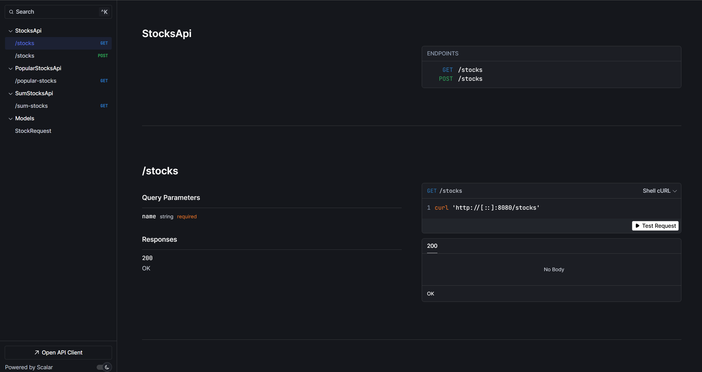

# Stock Market Game

A .NET web backend application that simulates real-time stock price movements for a set of fictional stocks.



## Project Overview
This application simulates a stock market by:

- Managing 10 fictional stocks (stock-1 through stock-10)
- Starting each stock at 1000 pounds
- Generating random whole-number price movements every second
- Simulating computationally intensive price calculations
- Providing real-time stock price updates

## Technical Implementation Details
The system implements:

- Concurrent processing of stock price updates
- Real-time price calculation simulation with artificial 1-second processing delay
- Whole number prices (no decimal places)
- REST API endpoints for retrieving current stock prices

## API Reference

It has been deployed to Render.com and is available at:

Base URL: https://stock-market-game.onrender.com

Available endpoints:
- GET /popular-stocks
- GET /stocks?name={stockName}
- GET /sum-stocks

## Prerequisites

- [Docker](https://www.docker.com/get-started)
- [.NET SDK 9.0](https://dotnet.microsoft.com/download/dotnet/9.0) (only needed for local development)

## Quick Start with Docker

1. Clone the repository:
```bash
git clone https://github.com/tjmcdonough/stock-market-game.git
cd stock-market-game
```

2. Build the Docker image:
```bash
docker build -t stock-market-game .
```

3. Run the container:
```bash
docker run -d -p 8080:8080 -p 8081:8081 --name stock-market-game stock-market-game
```

The application will be available at:
- HTTP: `http://localhost:8080`
- HTTPS: `http://localhost:8081`

## Local Development

If you prefer to run the application locally without Docker:

1. Restore dependencies:
```bash
dotnet restore
```

2. Build the project:
```bash
dotnet build --configuration Release
```

3. Run the application:
```bash
dotnet run --project StockMarketGame
```

## Docker Configuration

The application uses a multi-stage Docker build process:
- Base image: `mcr.microsoft.com/dotnet/aspnet:9.0`
- Exposed ports: 8080 (HTTP) and 8081 (HTTPS)
- Build configuration: Release mode by default

## Troubleshooting

- If ports 8080/8081 are already in use, modify the port mapping in the docker run command:
```bash
docker run -d -p <new-port>:8080 -p <new-port>:8081 --name stock-market-game stock-market-game
```

- To view container logs:
```bash
docker logs stock-market-game
```